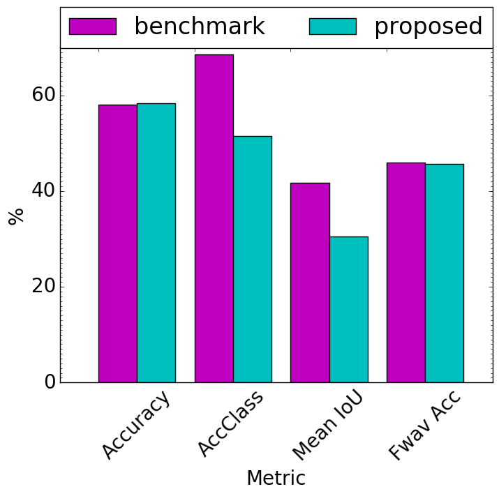
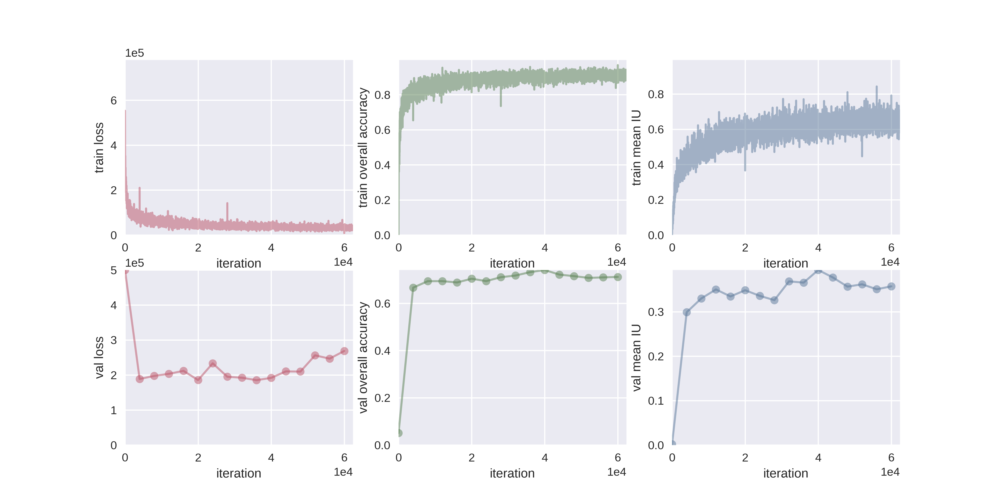
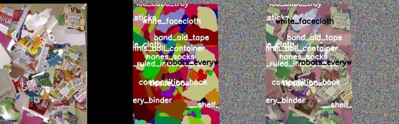
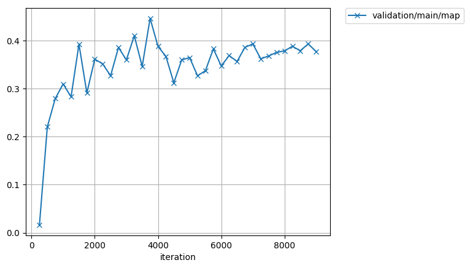
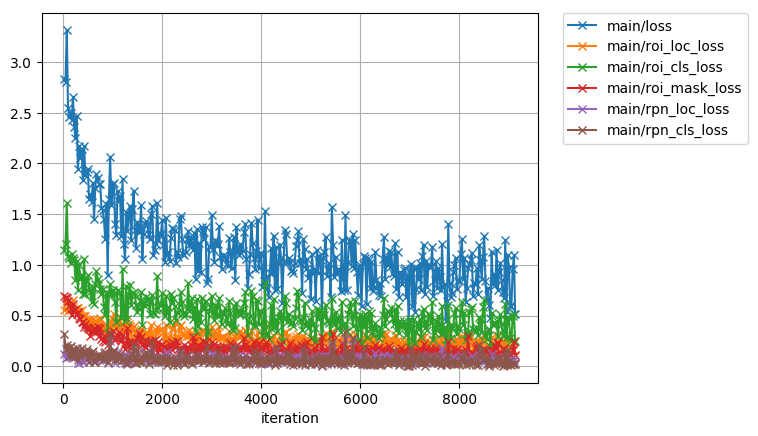
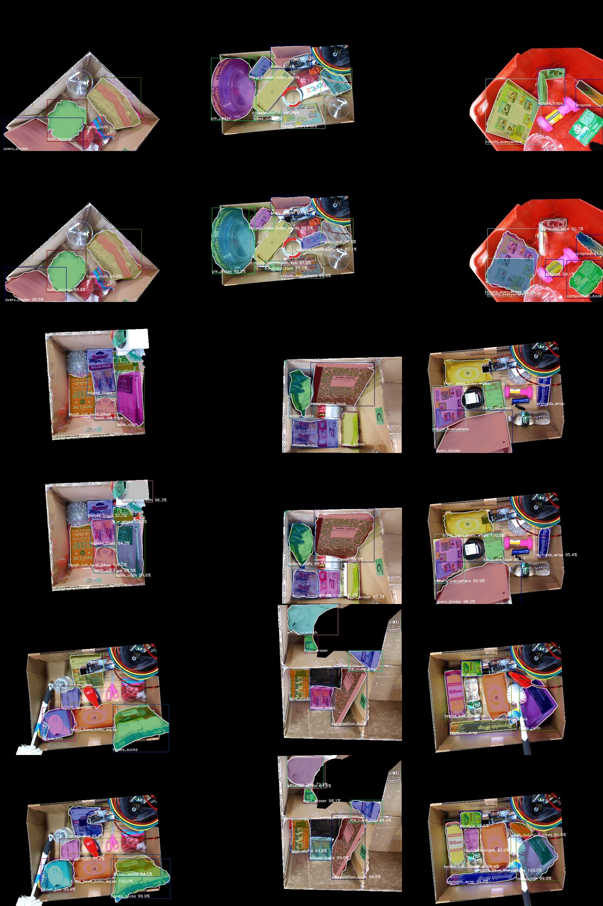
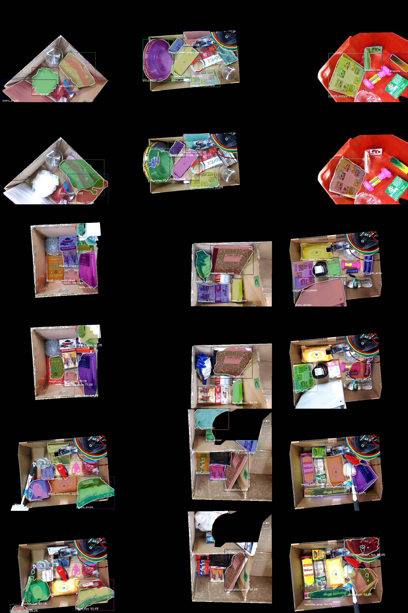
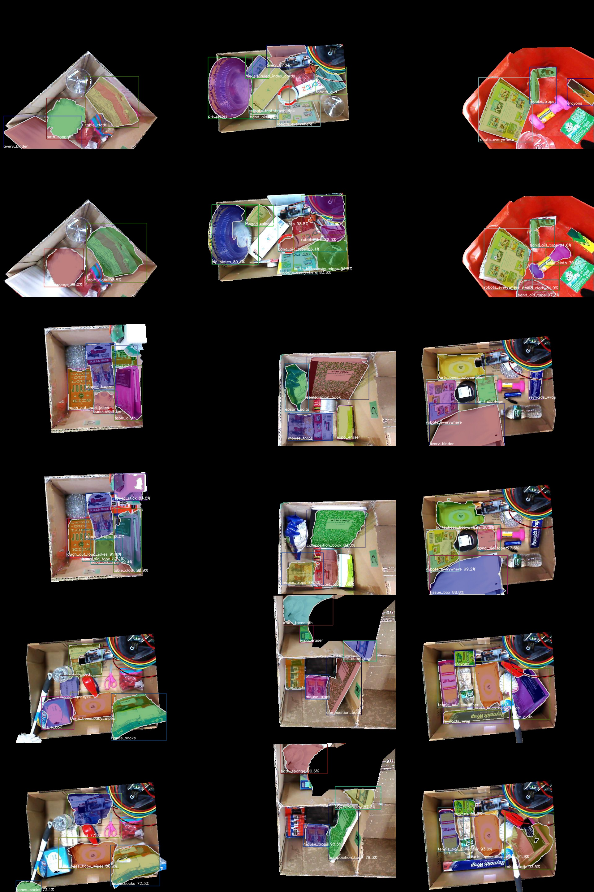

Deep Comparison and Segmentation Network (DCASN)
====================================
DCASN is used for tracking and segmenting handheld objects in
real-time. This repository provides the details of DCASN architecture,
the dataset and trained models. The evalution results are also
provided.

Note
------------
We will make our dataset and trained models publicly available once
our work has been published.

------------

Requirements
------------
- [ROS Indigo or higher](http://wiki.ros.org/kinetic)
- [CUDA (7.5 or higher)](https://developer.nvidia.com/cuda-downloads)
- [OpenCV 3.0 or higher](https://github.com/opencv/opencv)
- [image_view](https://github.com/ros-perception/image_pipeline)
- [Caffe](https://github.com/BVLC/caffe) 


Downloading the Package
------------
```bash
$ git clone https://github.com/iKrishneel/dcasn.git
$ cd dcasn
$ git pull --all
```

Handheld Object Dataset
------------
Coming soon

Trained Models
------------
Coming soon

Videos
------------
You can view the full videos of our results [here](https://drive.google.com/open?id=0B5hRAGKTOm_KNUV4R3lkTzVHY1U)

  
  


Semantic Segmentation
------------

**We used the accumulated object models to train
[FCN](https://github.com/shelhamer/fcn.berkeleyvision.org) network for
semantic segmentation.**

Plot showing the performace of FCN trained using our models and the
benchmark FCN trained using the manually annotated ground truth
datasets



------------

**Training and Validation Plots**

The training and validation plot of FCN trained using the models
accumulated using our models.


------------

Visualization of the cluttered bin segmentation task.



------------


Instance Segmentation using Mask R-CNN
------------

**We also used the accumulated models to train object detector using
[Mask RCNN](https://github.com/matterport/Mask_RCNN) for instance
segmentation.**

Plot showing the training loss and accuracy of Mask RCNN detector
trained using the object models accumulated using our method.

  

Visualization of instance detection and segmentation.

  


